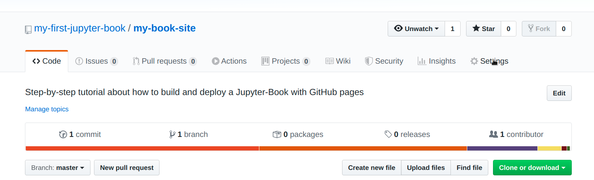
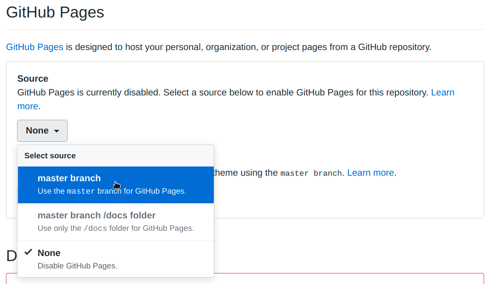
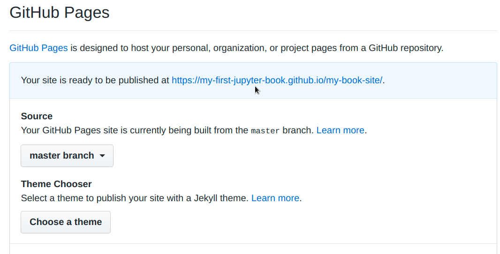
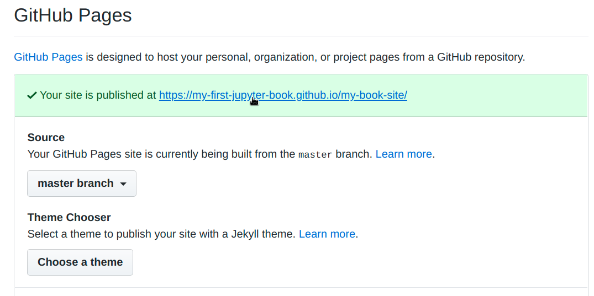
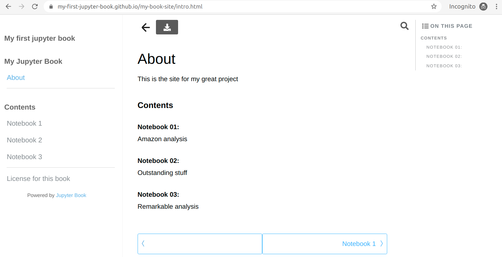

# How to create an on-line Jupyter Book from scratch

I recently used the [jupyter-book](https://pypi.org/project/jupyter-book/) package to build an on-line book version of one of [my projects](https://github.com/pabloinsente/comp_models_cog_beh). This package simplifies the creation of websites hosting interactive [Jupyter Notebooks](https://jupyter.org/), by providing a series of scripts that will transform your Notebooks into Jekyll pages. [Jekyll](https://jekyllrb.com/) is a minimalistic static website and blog generator. Websites built with Jekyll can be freely and easily hosted with [GitHub pages](https://pages.github.com/).

Instructions about how to build and deploy jupyter-book can be found in the [package documentation](https://jupyterbook.org/intro), which is an example of a jupyter-book in itself. Although the documentation is extensive and detailed, I had significant trouble building and deploying my notebooks in jupyter-book format. This is completely understandable, since jupyter-book is a project in active development, with lots of moving pieces, so sometimes the documentation may be unclear for some users (like me). 

My purpose is to provide a step-by-step guide to build a minimalistic version of jupyter-book. I'll explain everything as plain as possible, without very minimal assumptions about background knowledge. I only assume you know what the terminal is, and that you can type stuff in it to make things happen in your computer. I think jupyter-book is an amazing project, and that providing a guide to build and deploy a book may significantly help to increment its adoption, saving time and trouble to potential users.

## The situation

You have a bunch of Jupyter Notebooks that you want to share with people. These may be the result of your analysis, a tutorial, workshop, or some other thing. Now, you have a couple of options:

1. **Run locally**: put everything on GitHub, and ask people to get the repo, set up their computers with all the requirements, and run everything locally.
2. **Run in binder**: put everything in GitHub, create a link to https://mybinder.org/ with the right configuration, so that people can run the notebooks in the cloud.
3. **Run on a website**: build a website with links to cloud computing instances.

*Option 1* one is easier for you, but harder for the user. *Option 2*, is a bit harder for you, but easy for the user. *Option 3 is the hardest for you, but easier for the user*. Let's say you're willing to do more work to create the best possible experience for the user. This is when using jupyter-books is your best option. It minimizes the time and effort requited to built the website and provides an outstanding experience to the user. 

## What do you need to begin

As a minimum, you need these things:

- A python 3.6 or 3.7 installation https://www.python.org/downloads/
- A git installation https://git-scm.com/book/en/v2/Getting-Started-Installing-Git 
- A UNIX-based system (Mac OS or any Linux distribution). If you are a Windows user, consider to use the [Linux Subsystem for Windows](https://docs.microsoft.com/en-us/windows/wsl/install-win10), [Gitbash](https://gitforwindows.org/), or [Cywin](https://www.cygwin.com/)
- A couple of jupyter-notebooks (`.ipynb` extension) and/or markdown documents (`.md` extension)

That's it. Technically, if you look at the [jupyter-book documentation](https://jupyterbook.org/guide/02_create.html), you'll see that there other things that would be nice to have beforehand, like a configuration file (i.e., `_config.yml`) and a table of contents file (i.e., `toc.yml`). However, those files are not strictly necessary to begin your project, so we will restrict ourselves to the bare minimum: *some content you want to put on-line*. 

## Creating the book, step-by-step

Now, we will create the book using the command line, step-by-step.

### Step 1: create directory for the book

Open the terminal and navigate to your `Desktop` by:

```bash
cd Desktop/
```

Now, let's create a directory for the project

```bash
mkdir my-book-files 
mkdir my-book-files/notebooks
```

***Copy and paste your Jupyter Notebooks to the `my-book-files/notebooks/` folder***

### Step 2: create and activate a virtual environment

It is always a good idea to create a virtual environment to isolate your dependencies for each project. This is not strictly required, yet highly recommended. Make sure you are in the `Desktop` directory in your terminal and move to the project directory: 

```bash
# move to terminal to the project directory
cd my-book-files/
```

Once there, run this in the terminal to create the virtual environment:

```python
# This line creates a virtual environment called 'venv'
python3 -m venv venv 
# This line activates the virtual environment 
source venv/bin/activate 
```

Once the virtual environment is activated, packages will be installed in that environment, without interfering with your python system installation.  

**HEADS UP**: if you close the terminal or deactivate `venv`, make sure to re-activate the virtual environment with `source venv/bin/activate` before typing any code.

### Step 3: install jupyter-book package

The jupyter-book package can be pip-installed like this:

```python
pip install jupyter-book
```

Now, if you run:

```bash
pip list | grep jupyter-book
```

You should see something like this (version may change) printed to the terminal:

```bash
jupyter-book       0.6.4  
```

### Step 4: create a jupyter-book template

The whole point of `jupyter-book` is to provide a template that will make creating  your book-site fast and easy. A template for your book can be created by running:

```bash
jupyter-book create my-book
```

If correctly created, the (last part of the) output should look similar to this:

```
================================================================================

Finished creating a new book at `./my-book`
- Your content is in `./my-book/content` 

- A Table of Contents file is at `./my-book/_data/toc.yml`.
  You should check its contents, make sure it references your
  content correctly, and ensure it has the correct order.

- Your configuration file is at `./my-book/_config.yml`.
  You should check its contents and double-check that the values  are correct for your site.

Notes
=====
- Add your own content to your book. You haven't provided any content (`--content-folder`)
  so we've added a couple files to get you started.
- We've added a CC-BY-SA license for you in ./my-book/content/LICENSE.md
  This is a reasonable license for most book content, though feel free
  to change it if you like!
================================================================================
```

### Step 5: remove the files in the `my-book/contents/` directory 

The `contents/` folder in the `my-book/` folder is the one containing the files and structure that will be used by the `jupyter-book` package to build your site. As it now, it contains a few demo-files. Let's remove those files to then replace them with your content. 

Assuming that you are in `my-book-files/` directory, type this to remove the demo-files:

```bash
# remove .ipynb and .md files
rm my-book/content/features/*
# remove unnecesary images
rm -r my-book/content/images/*
# remove intro
rm my-book/content/intro.md 
```

Now, type this to look at the directory contents:

```bash
# list directory with subdirectories
ls -lR my-book/content/
```

And the output should look similar to: 

```bash
my-book/content/:
total 12
drwxr-xr-x 2 pablo pablo 4096 Feb 10 17:09 features
drwxr-xr-x 2 pablo pablo 4096 Feb 10 17:10 images
-rwxr-xr-x 1 pablo pablo  257 Feb 10 16:19 LICENSE.md

my-book/content/features:
total 0

my-book/content/images:
total 0
```

This indicates that `my-book/content/` contains the `feature/` directory, an `images/` directory, and a `LICENSE.md` file. I keep the license file because it is a standard practice to have an open-source license for every project. If that doesn't work for you, just change the contents of the license as you need.

### Step 6: add your contents to the `my-book/contents/` directory 

Again, assuming you are in the `my-book-files/` directory in the terminal and that your content is in the `my-book-files/notebooks/`. Type this to incorporate your files into the book:

```bash
cp -a notebook/* my-book/content/features/
```

This will recursively copy the contents of your `notebook/` directory into the  `my-book/content/features/` directory.

**Note about images**: if you have images linked to your notebooks, this is what you need to do:

- Make sure that the images are linked to your notebook by a *relative path* linked to the `images/` folder. The file structure should look like this:

  ```bash
  my-book-files/notebooks/notebook-with-the-linked-image.ipynb
  my-book-files/images/image-linked-to-notebook.png
  ```

- Now, if you have images, type this to pass the images into the book images folder:

  ```bash
  cp -a images/* my-book/content/images/
  ```

- And you are done.

**Note about an intro or about file**:

- If you have some sort of introduction to your notebooks, let's say, an `intro.md` file, you just need to repeat the process of copying the file to the  `my-book/content/` directory:

  ```
  cp intro.md my-book/content/
  ```

Assuming that you have a `notebooks/` directory, an`images/` directory, and an `about.md` file, your `my-book/content/` directory should look like this now:

```bash
# list directory with subdirectories
ls -lR my-book/content/
# output printed to the terminal
my-book/content/:
total 12
-rw-r--r-- 1 pablo pablo    0 Feb 10 17:37 intro.md
drwxr-xr-x 2 pablo pablo 4096 Feb 10 17:24 features
drwxr-xr-x 2 pablo pablo 4096 Feb 10 17:37 images
-rwxr-xr-x 1 pablo pablo  257 Feb 10 16:19 LICENSE.md

my-book/content/features:
total 124
-rw-r--r-- 1 pablo pablo 34958 Feb  7 10:24 01-notebook.ipynb
-rw-r--r-- 1 pablo pablo 10221 Feb  7 10:54 02-notebook.ipynb
-rw-r--r-- 1 pablo pablo 74105 Feb  7 10:24 03-notebook.ipynb

my-book/content/images:
total 0
-rw-r--r-- 1 pablo pablo 0 Feb 10 17:37 image1.png
-rw-r--r-- 1 pablo pablo 0 Feb 10 17:37 image2.png
```

### Step 7: create a table of contents file matching the contents of your book

Now that you have your contents in place, you need a *table of contents* to match that. The table of contents  is the `my-book/_data` in the `toc.yml` file. You have two options for this: to modify the existing `toc.yml` file to match the contents or to create a new one from scratch. The existing one has too much info to absorb, so I'll create a new one to explain each component. Feel free to use tour favorite text editor to edit the file

```bash
# create an empty toc.yml file  
touch toc.yml
# open the file in nano / or use whatever you like
nano toc.yml
```

From the jupyter-book documentation, we know that each `toc.yml` has the following schema:

```bash
# - title: mytitle   # Title of chapter or section
#   url: /myurl  # URL of section relative to the /content/ folder.
#   sections:  # Contains a list of more entries that make up the chapter's sections
#   not_numbered: true  # if the section shouldn't have a number in the sidebar
#     (e.g. Introduction or appendices)
#   expand_sections: true  # if you'd like the sections of this chapter to always
#     be expanded in the sidebar.
#   external: true  # Whether the URL is an external link or points to content in the book
#
# Below are some special values that trigger specific behavior:
# - search: true  # Will provide a link to a search page
# - divider: true  # Will insert a divider in the sidebar
# - header: My Header  # Will insert a header with no link in the sidebar
```

Next, let's populate the file with a few elements. Remember that the path to the files are relative to the `contents/` directory

**HEADS UP**: 

- each `.md` and `.ipynb` file has to have some content in it. Also remember to add a top header (with # My title), since it will be used as the title to the section on the website. 
- Remember to *omit* the file extension ( `.md` and `.ipynb` ) when passing the URL

```bash
# add the top header 
- header: My Jupyter Book

# add the 'about.md' section at the top 
- url: /intro
  not_numbered: true

# ad a divider: a divider is just a black line separating sections. It is just aesthetics.
- divider: true

# add a second header
- header: Contents

# add the first notebook
- url: /features/01-notebook
  not_numbered: true

# add the second notebook
- url: /features/02-notebook
  not_numbered: true
 
# add the third notebook
- url: /features/03-notebook
  not_numbered: true
  
# another divider
- divider: true

# add the LICENSE 
- url: /LICENSE
  not_numbered: true
```

Now, let's remove the old `toc.yml` file and past the new one:

```bash
rm my-book/_data/toc.yml 
cp toc.yml my-book/_data/
```

### Step 8: add a `requirements.txt` file 

The chances are that you are using some python package for your analysis. If so, you'll need to create a `requirements.txt` file containing the package names and versions for your project:

```bash
# create an empty toc.yml file  
touch requirements.txt
# open the file in nano
nano requirements.txt
```

Then, populate your `requirements.txt` with your dependencies. For instance, in my case they look like this:

```bash
altair==4.0.1
numpy==1.18.1
matplotlib==3.1.2
pandas==0.25.2
jupyterlab==1.2.5
keras==2.3.1
vega_datasets
```

Note that if you just want the latest version of the package to be used, you can omit the `==version-number` part (as in the `vega_datasets`), and just pass the package name. This is not recommended because future releases of the package may break your code functionality. The best is just to figure out the exact package versions you are using. One way is to type `pip list` (assuming you are using `pip`) or `conda list` (if you are using `conda`) in the terminal, in the directory and environment where you ran your code. 

Now, let's remove the old `requirements.txt` file and past the new one:

```bash
rm my-book/requirements.txt
cp requirements.txt my-book/
```

### Step 9: create a GitHub account and a repository for the project

If you have a GitHub account already, you may be tempted to use your existing account to deploy your project. This may not be a good idea because that may interfere with your ability to use your GitHub account to deploy something more personal in the future, like a resume page or a blog. Also, if you are using GitHub pages already, deploying the site without messing up with your existing website may be tricky. Therefore, it is highly recommended to *create a GitHub account for the project*. You'll need an email account *not associated* with an existing GitHub account. With that, you can go to https://github.com/ and follow the Sing Up instructions. 


Once you are ready with your new account, create a new *empty repository* for the project.  This is, no *README*, no *LICENSE*, no *.gitignore*. Just empty. Normally, GitHub should prompt you to create a new repo when you verify your email account. If you created one, you can use that one for the next steps. Otherwise, follow steps 1 through 6 in the instructions here https://help.github.com/en/github/getting-started-with-github/create-a-repo


You can name your repo as you like, but let's assume that you name it `my-book-site/`. Now we need to connect the on-line repo with your machine. This time, make sure you are in your local `my-book/` directory, and follow these instructions:

```bash
# navigate to the book directory
cd my-book
# initialize tracking
git init 
```

The terminal should print back a message like this

```bash
Initialized empty Git repository in /home/YOUR-USERNAME/Desktop/my-book-files/my-book/.git/
```

Next, stage the files to be committed

```bash
# stage the files to be commited
git add -A
```

Now you need to commit the files that will be pushed to GitHub. Depending on your git configuration, the terminal may prompt you to enter your `user.email` and `user.name`. Use your newly created GitHub email and username for this, omitting the `--global`  option (if you set up this globally, it may generate problems for you later on).  

```bash
# commit the files to be pushed
git commit -m "First commit"

# assuming it ask your for "*** Please tell me who you are"
git config user.email "your.ney.email@gmail.com"
git config user.name "your-new-github-username"
# repeat the commit if necessary
git commit -m "First commit"
```

Next, connect your new GitHub repo with your local directory. You can get the URL of your repo in the repo home-page bellow "*Quick setup — if you’ve done this kind of thing before*" 

```bash
# here, replace <your-github-username> with your real username 
# also replace <my-book-site> with the name you gave to your repo
git remote add origin https://github.com/your-github-username/my-book-site.git
```

Finally, you need to push your local files to the GitHub repo. Notice that git should prompt you to enter your username and password. Use your newly created ones for the project:

```bash
# push the files
git push origin master

# If git prompts you:
Username for 'https://github.com': your-github-username
Password for 'https://my-first-jupyter-book@github.com': your-password
```

### Step 10: create a `_config.yml` configuration file

The last file we need to add is the `_config.yml` file. Again, one option is just to edit the exiting  `_config.yml` file in the `my-book/` directory. I'll fill in this step-by-step, again, just for the sake of explaining in detail what are you doing here:

```bash
# if you were at the my-book/ directory, go back to the my-book-files/ directory
cd ..
# create a new _config.yml file
touch _config.yml
# open it in your favorite edito, I'll use nano
nano _config.yml
```

This may look long and complicated, but it is not. You just need to **copy-paste everything to your `_config.yml`** and change a couple of lines that I'll flag for you with capitals as `#@@@ CHANGE THIS - number @@@#`. To make sure you don't miss any, I numbered the changes from 1 to 9. 

```bash
######################
# Jekyll site settings
######################
title: my-first-jupyter-book #@@@ CHANGE THIS -1 @@@#
author: Pablo Caceres #@@@ CHANGE THIS -2  @@@#
email: my.first.jupyter.book@gmail.com #@@@ CHANGE THIS -3 @@@#
description: >- # this means to ignore newlines until "baseurl:"
  My brand new book #@@@ CHANGE THIS - 4 @@@#
  
# the name of your GitHub Repo. 
# If there is no subpath for your site, use an empty string ""  
baseurl: "/my-book-site" #@@@ CHANGE THIS -5 @@@#


# the base hostname & protocol for your site. 
# Since we are deloying on GitHub pages, the URL has the format:
# "https://your-github-username.github.io/" 
# In my case is:
url: "https://my-first-jupyter-book.github.io/" #@@@ CHANGE THIS - 6 @@@#

#######################
# Jupyter Book settings
#######################

# Main page settings
# Optional: you can replace with <https://github.com/my-first-jupyter-book/my-book-site> your repo URL
footer_text               : View source repository at <a href="https://github.com/my-first-jupyter-book/my-book-site"></a> #@@@ CHANGE THIS - 7 @@@#

# Sidebar settings
show_sidebar              : true  # Show the sidebar. Only set to false if your only wish to host a single page.
collapse_inactive_chapters: true  # Whether to collapse the inactive chapters in the sidebar
collapse_inactive_sections: true  # Whether to collapse the sub-sections within a non-active section in the sidebar
#textbook_logo             : images/logo/logo.png  # A logo to be displayed at the top of your textbook sidebar. Should be square
#textbook_logo_link        : https://jupyterbook.org/intro.html  # A link for the logo.
sidebar_footer_text       : 'Powered by <a href="https://jupyterbook.org">Jupyter Book</a>'
number_toc_chapters       : true  # Whether to add numbers to chapterse in your Table of Contents. If true, you can control this at the Chapter level in _data/toc.yml

# Search settings
search_max_words_in_content : 100  # In the search function, use at most this many words (too many words will make search slow)

# Controlling page information
page_titles                    : infer  # Either `None`, `infer`, or `toc`
page_authors                   : None  # Either `None` or `infer`
filename_title_split_character : '_'  # If inferring titles based on filename, splt on this character.

# Math settings
number_equations               : false  # Whether to automatically number all block equations with MathJax

########################
# Interact link settings
########################

# General interact settings
use_jupyterlab                   : false  # If 'true', interact links will use JupyterLab as the interface

# Jupyterhub link settings
use_jupyterhub_button            : false  # If 'true', display a button that will direct users to a JupyterHub (that you provide)
jupyterhub_url                   : ""  # The URL for your JupyterHub. If no URL, use ""
jupyterhub_interact_text         : "Interact"  # The text that interact buttons will contain.

# Binder link settings
use_binder_button                : true  # If 'true', add a binder button for interactive links
binderhub_url                    : https://mybinder.org  # The URL for your BinderHub. If no URL, use ""


binder_repo_base                 : https://github.com/my-first-jupyter-book/my-book-site  #@@@ CHANGE THIS @@@  -8 # # The site on which the textbook repository is hosted
binder_repo_org                  : my-first-jupyter-book  #@@@ CHANGE THIS @@@ - 9# # Your GitHub username

binder_repo_name                 : my-book-site  # The project repo name
binder_repo_branch               : master  # The branch on which your textbook is hosted.
binderhub_interact_text          : "Interact via Binder"  # The text that interact buttons will contain.

# Thebelab settings
use_thebelab_button              : true  # If 'true', display a button to allow in-page running code cells with Thebelab
thebelab_button_text             : "Thebelab"  # The text to display inside the Thebelab initialization button
codemirror_theme                 : "abcdef"  # Theme for codemirror cells, for options see https://codemirror.net/doc/manual.html#config

# nbinteract settings
use_show_widgets_button              : true  # If 'true', display a button to allow in-page running code cells with nbinteract

# Download settings
use_download_button              : true  # If 'true', display a button to download a zip file for the notebook
download_button_text             : "Download" # The text that download buttons will contain
download_page_header             : "Made with Jupyter Book" # A header that will be displayed at the top of and PDF-printed page

#######################################################################################
# Jupyter book settings you probably don't need to change

content_folder_name       : "content"  # The folder where your raw content (notebooks/markdown files) are located
images_url                : "/assets/images" # Path to static image files
css_url                   : "/assets/css" # Path to static CSS files
js_url                    : "/assets/js" # Path to JS files
custom_static_url         : "/assets/custom" # Path to user's custom CSS/JS files

#######################################################################################
# Jekyll build settings (only modify if you know what you're doing)

# Site settings
defaults:
  - scope:
      path: ""
    values:
      layout: "default"
      toc: true
      toc_label: "  On this page"
      toc_icon: "list-ul"
      excerpt: ''

favicon_path: "images/logo/favicon.ico"

# Markdown Processing
markdown: kramdown
kramdown:
  input: GFM
  syntax_highlighter: rouge

sass:
  style: compressed

collections:
  build:
    output: true
    permalink: /:path.html

# Exclude from processing.
# The following items will not be processed, by default. Create a custom list
# to override the default setting.
exclude:
  - scripts/
  - Gemfile
  - Gemfile.lock
  - node_modules
  - vendor/bundle/
  - vendor/cache/
  - vendor/gems/
  - vendor/ruby/

plugins:
  - jekyll-redirect-from
  - jekyll-scholar

# Jupyter Book version - DO NOT CHANGE THIS. It is generated when a new book is created
jupyter_book_version: "0.6.4"
```

Once you are done with the 9 changes, replace the old `_config.yml` with the new one:

```bash
rm my-book/_config.yml
cp _config.yml my-book/
```

### Step 11: build the `html` files to deploy with `jupyter-book`

Everything is in place now. The last step before deploying your site is to build the `html` files like this:

```bash
jupyter-book build my-book/
```

If successful, the terminal should print something like:

```bash
================================================================================


Generated 5 new files
Skipped 0 already-built files
Your Jupyter Book is now in `_build/`.
Demo your Jupyter book with `make serve` or push to GitHub!


================================================================================
```

### Step 12: push the site contents to GitHub and deploy as GitHub pages

You can test your site locally by navigating into your book and running `make serve`. You need Ruby and a bunch of tools (gems) installed to do that, so I won't get into that now. Let's push and deploy on GitHub pages. 

First, add, commit, and push the changes to GitHub:

```bash
git add -A
git commit -m "my first jupyter book"
git push origin master
```

Now, go to the repo`Setting` as shown in the picture below



Then, enable `GitHub pages` in your master branch as shown below



If successful, you should see this message:



After a couple of minutes (usually 1 or 2 minutes), you should see this message (refresh the page too see the update):



Finally if you click the link, and everything went well, your site should be ready to use! for instance, the page that I created for this tutorial can be found [here](https://my-first-jupyter-book.github.io/my-book-site/intro.html), and it looks like this:



### Bonus: updating your site

You may need to update your site from time to time. There are two situations: when you modify files maintaining the same structure, and when you add new elements, like another markdown file or Jupyter Notebook. 

In the first scenario, you need to:

1. add the changes to the website local repo
2. rebuild the site running `jupyter-book build my-book/` again
3. push the changes to GitHub.

The site should be rebuilt on-line by GitHub pages with the changes

In the second scenario, you need to:

1. add the new files to the website local repo
2. modify the `toc.yml` to match your new file structure (`url`)
3. rebuild the site running `jupyter-book build my-book/` again
4. push the changes to GitHub.


That's it. I hope this tutorial was helpful. For more details and info please check the [oficial jupyter-book documentation](https://jupyterbook.org/intro).

***

This is my professional website: https://pablocaceres.org/

This is my Twitter account: https://twitter.com/CodeBug88

This is my GitHub account: https://github.com/pabloinsente

[Back to the top](#how-to-create-an-on-line-jupyter-book-from-scratch)

